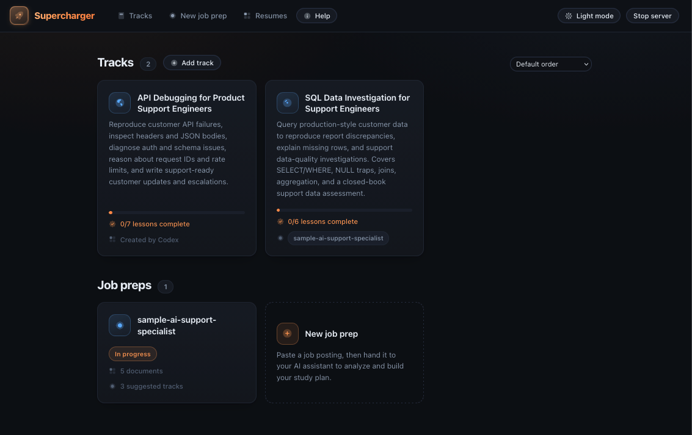
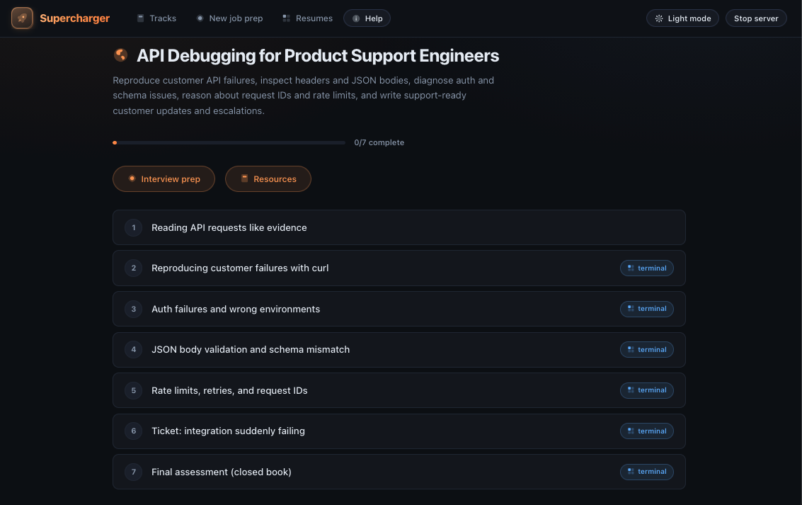
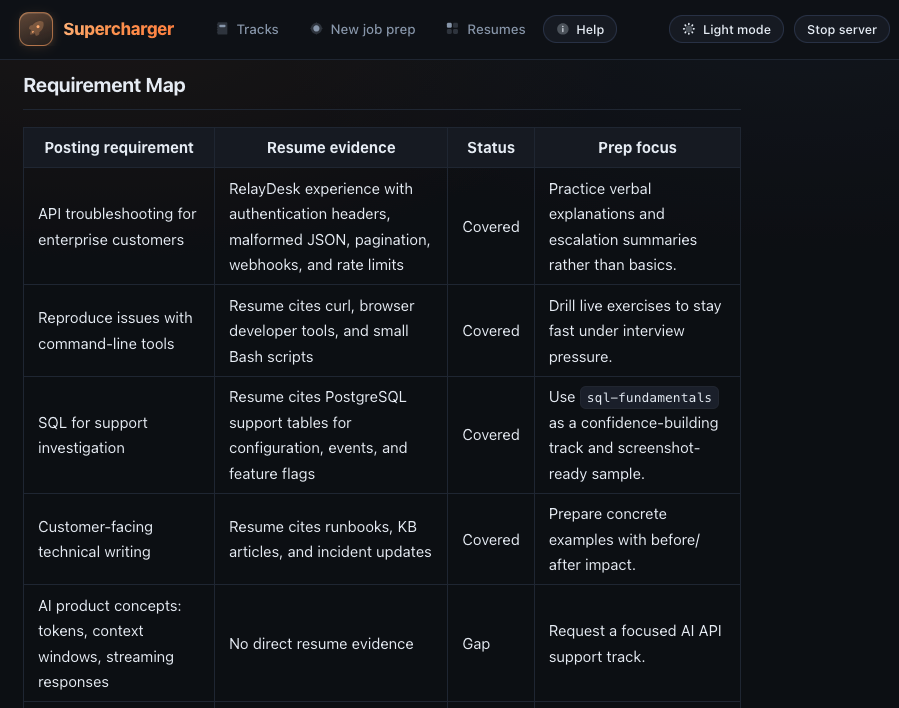
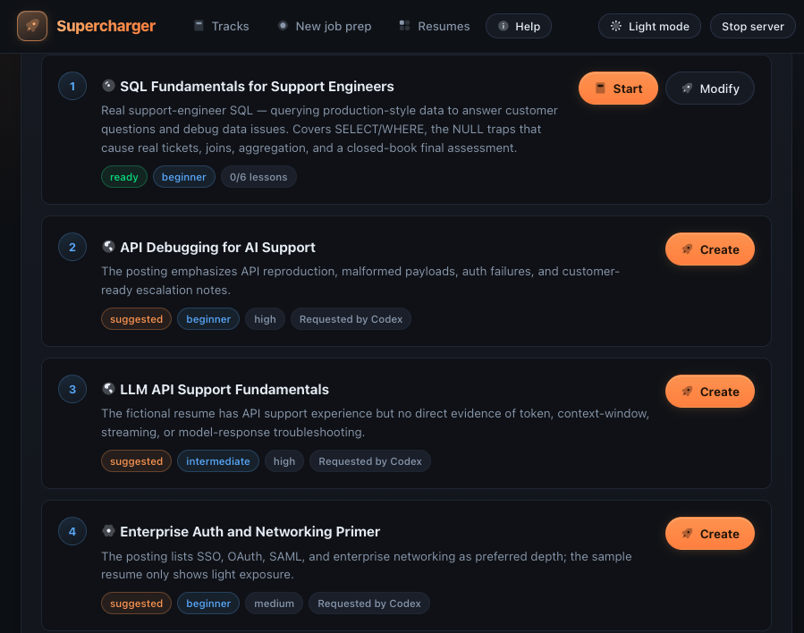
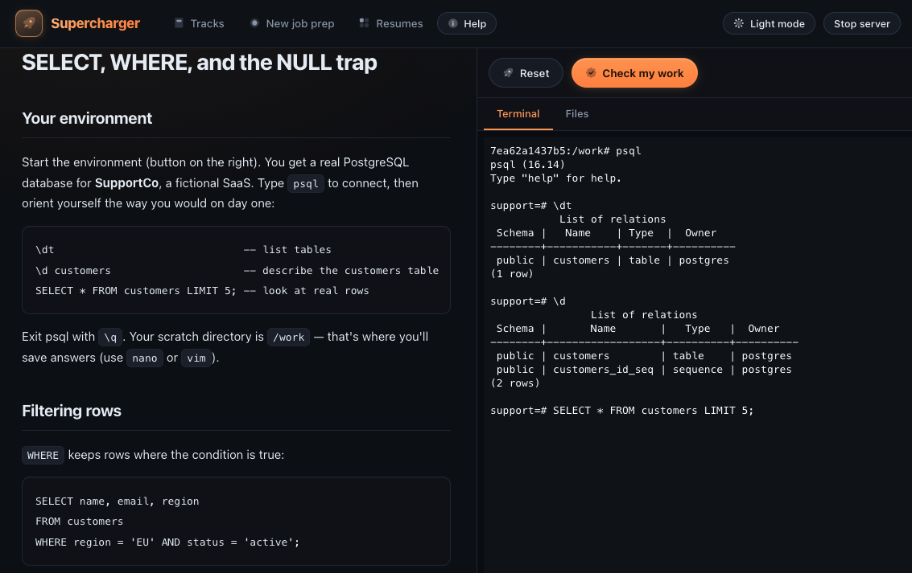

# ⚡ Supercharger

**Turn technical documentation and knowledge gaps into realistic, validated
practice.** Supercharger is an open-source technical readiness platform where
your AI coding assistant is the curriculum engine: feed it a skill gap, a job
posting, or your product docs, and get structured tracks with sandboxed
hands-on labs, realistic scenario tickets, written-response drills, and
checkpoint-validated exercises.

Built for technical practitioners — support engineers, solutions engineers,
SREs, TAMs, junior engineers — and the leads who onboard them. Ask for a track
on SQL, OAuth debugging, Bash, Go, SSL troubleshooting… or hand a new hire a
readiness track generated from your runbooks and API docs.

Local-first: no accounts, no telemetry, no API keys. Your assistant (Claude
Code, Codex, Gemini CLI — anything that reads `AGENTS.md`) generates the
content; Supercharger renders it as guided lessons with a **real terminal into
disposable Docker sandboxes** and automated "check my work" validation.
By default it listens only on your machine; you can explicitly allow other
devices on your trusted local network from the top bar.

> Tools like [Career Ops](https://career-ops.org) get you the interview.
> Supercharger gets you *through* it.

📚 **Docs:** https://supercharger.richpolanco.com/



## How it works

1. **Tracks** are folders of markdown lessons (see `SPEC.md`). Conceptual
   lessons render with inline quizzes and structured practice blocks for case
   files, diagnosis checkpoints, timelines, compare-and-explain drills, recall
   cards, and written responses. Hands-on lessons add a terminal pane backed
   by a per-lesson Docker container — a real Postgres with messy data, a broken
   nginx cert, whatever the scenario needs. A `check` script inside the
   container validates your work checkpoint by checkpoint. Hit **Reset** to
   recreate the sandbox at any time.
2. **Preps** turn a job posting into a study plan. Paste the posting (and
   optionally your resume) via **New job prep**, then tell your assistant to
   generate prep materials. It produces three documents:
   - `analysis.md` — maps each requirement to existing tracks, partial gaps,
     or missing coverage; when a resume is provided, each item is marked
     covered / partial / gap with resume citations
   - `plan.md` — ordered study plan prioritized by gap severity, with
     skim-vs-drill guidance
   - `interview-prep.md` — role-specific likely questions, model answers, and
     follow-up chains; covered experience becomes talking points
   
   Gap tracks are queued in `track-requests.json` so the app can list and
   generate them on demand. When the job requires company/product fluency,
   preps can include a **docs onboarding** curriculum built from approved
   source docs — product maps, glossaries, support tickets, escalation writing,
   and a readiness assessment.
3. **Your assistant does the authoring.** `AGENTS.md` is the contract: format,
   quality bar ("no fluff, scenario tickets, honest resource tiers, closed-book
   final assessment"), and hard rules. Say *"generate a track on Go"* or
   *"prep me for the posting in preps/acme/"* and refresh the app.
4. **Tracks can be shared privately.** Export any track as a
   `.supercharger-track.zip`, review it, and distribute it from a private
   GitHub repo, internal docs page, or team drive. Teammates import the zip
   into their own local Supercharger workspace.

## Product tour

### Track library

Supercharger ships with practical sample tracks and keeps generated tracks as
plain folders you can inspect, edit, and version.



### Job prep from a posting and resume

Supercharger turns a pasted posting and optional resume into a requirement map,
gap-aware study plan, interview prep, and queued track requests.





### Validated hands-on lessons

Hands-on lessons combine realistic case files, written triage prompts, and a
real terminal into a disposable Docker sandbox. The same lesson page renders
the scenario, terminal, files, and checkpoint results.



## Quickstart

**Prerequisites:** Node 20+, Git, Docker (Desktop or OrbStack — only needed
for sandbox lessons), and an AI coding assistant CLI (Claude Code, Codex, or
Gemini CLI).

```bash
git clone https://github.com/mrpolanco/Supercharger && cd Supercharger
npm install
npm run dev          # API server :4400 + app at http://localhost:4401
```

If you see a "port already in use" error, find the existing `npm run dev`
terminal and press **Ctrl+C**, then restart.

Three complete samples ship in the box:

- **SQL Data Investigation for Support Engineers** — customer-data queries,
  NULL traps, joins, aggregation, a realistic "customer export is missing
  rows" ticket, written response practice, and a closed-book support data
  assessment.
- **API Debugging for Product Support Engineers** — `curl` reproduction,
  headers, auth/environment mistakes, JSON validation, rate limits, request
  IDs, customer updates, escalations, and a closed-book API support screen.
- **Sample AI Platform Support Specialist prep** — a fictional job posting and
  resume with generated requirements analysis, study plan, interview prep,
  curriculum ordering, and suggested gap tracks.

## Your data is yours

- Content is plain markdown/YAML — readable, diffable, portable.
- `progress.json`, `resumes/`, and your personal prep folders are local state;
  the public repo includes only sanitized sample prep data.
- Nothing leaves your machine. Sandboxes are resource-capped, disposable
  containers.

## Repo layout

| Path | What |
|---|---|
| `SPEC.md` | Content format contract (tracks, quizzes, practice blocks, sandboxes, checks, preps) |
| `AGENTS.md` | The agent contract — how assistants generate content here |
| `tracks/` | Skill tracks (reference: `sql-fundamentals/`) |
| `preps/` | Job-specific preparation packs (`analysis.md`, `plan.md`, `interview-prep.md`, `track-requests.json`) |
| `server/`, `web/` | The app: Node sandbox runner + React/xterm.js UI |

## Contributing

Tracks are just spec-compliant folders — community tracks are very welcome.
Read `SPEC.md` and `AGENTS.md`, match the depth of the bundled SQL track, and
open a PR. App changes: keep the app thin; the content format and runner API
are the stable surfaces.

## License

MIT — see `LICENSE`.
